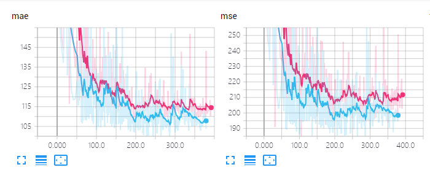
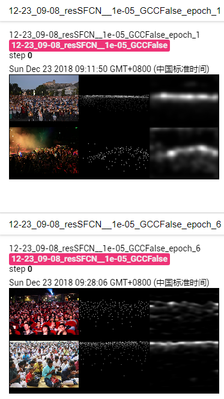
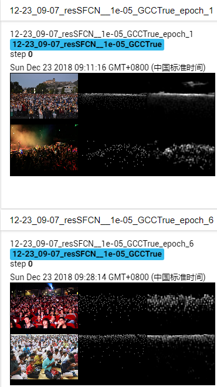
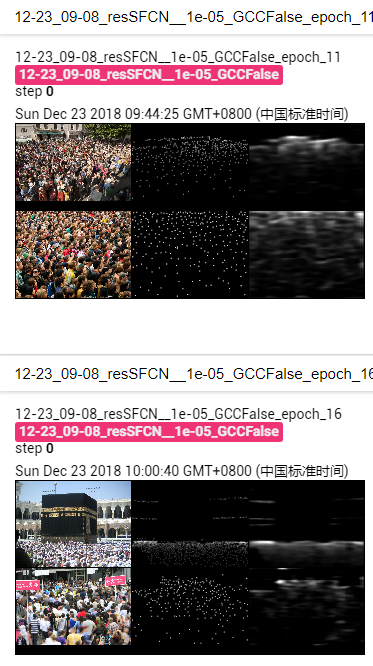
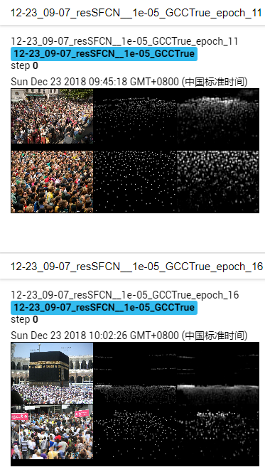
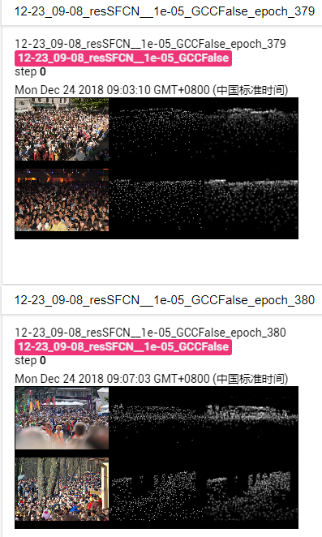

# SFCN in "Learning from Synthetic Data for Crowd Counting in the Wild"

This is an official implementaion of the paper "SFCN+" in **Learning from Synthetic Data for Crowd Counting in the Wild**.


##  Requirements
- Python 2.7
- Pytorch 0.4.0 
- TensorboardX (pip)
- torchvision  (pip)
- easydict (pip)
- pandas  (pip)


## Data preparation
1. Download the original UCF-QNRF Dataset [Link: [Dropbox ](http://crcv.ucf.edu/data/ucf-qnrf/)]
2. Resize the images and the locations of key points. 
3. Generate the density maps by using the [code](https://github.com/aachenhang/crowdcount-mcnn/tree/master/data_preparation).
4. Generate the segmentation maps.

We provide the processed QNRF dataset for training. [[Link](https://mailnwpueducn-my.sharepoint.com/:f:/g/personal/gjy3035_mail_nwpu_edu_cn/EkxvOVJBVuxPsu75YfYhv9UBNBbPYRwIEpr76kZf0sRUYw?e=JuSAqz)]

The pre-trained resSFCN on GCC: [[Link](https://mailnwpueducn-my.sharepoint.com/:f:/g/personal/gjy3035_mail_nwpu_edu_cn/EjgL9bSXYO1GvgdLIigURQUBPZ2GMDmPpF71JZTBtWj_jA?e=VAWhFB)]

## Training model
1. Run the train.py: ```python train.py```.
2. See the training outputs: ```Tensorboard --logdir=exp --port=6006```.


## Expermental results

### Quantitative results

Errors on test set:



Note: the blue line is the result of using pre-trained GCC Dataset, and the red is the result of using pre-trained ImageNet. 
 
 
### Visualization results

|   | Pre-trained ImageNet | Pre-trained GCC | 
|------|:------:|:------:|
| epoch 1,6| |  | 
| epoch 11,16 | |  | 
| epoch 379,380 | |  | 

Column 1: input image; Column 2: density map GT; Column 3: density map prediction.


## One More Thing

We reproduce some classic networks (MCNN, CSRNet, SANet, etc.) and some solid baseline networks (AlexNet, VGG, ResNet, etc.) on GCC dataset. Welcome to visit this [link](https://github.com/gjy3035/C-3-Framework). It is under development, we will release it as soon as possible.

## Citation
If you use the code, please cite the following paper:


